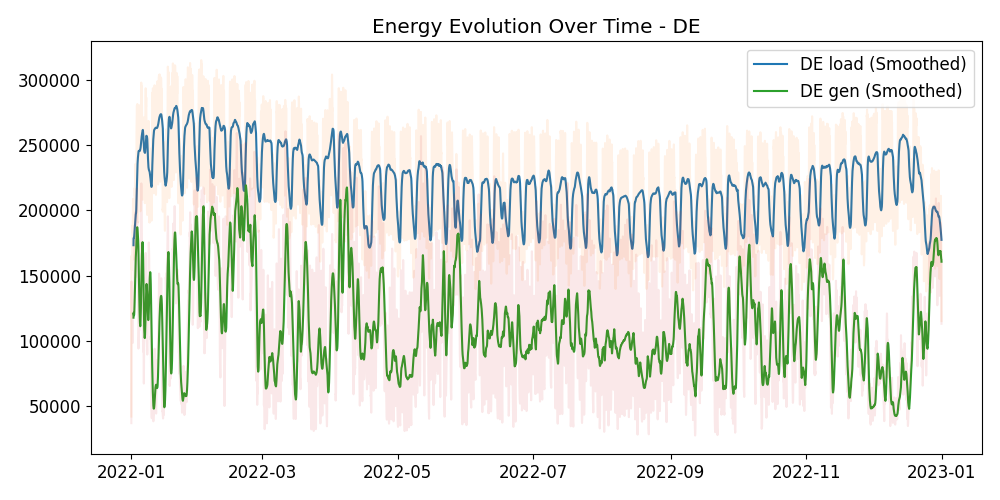
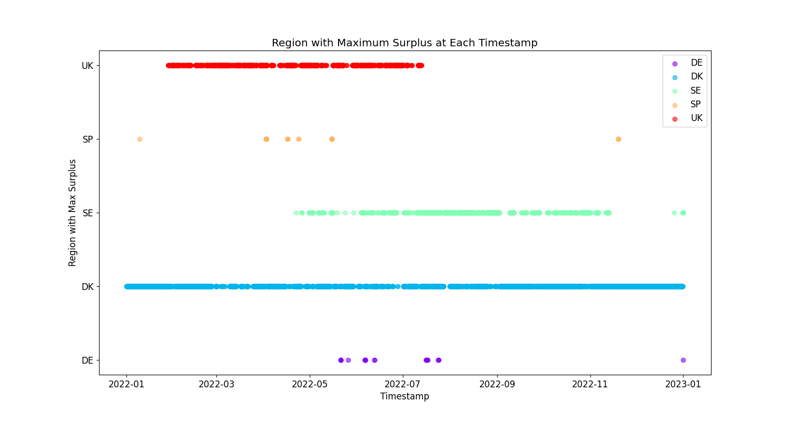

# NUWE: EcoForecast



## Summary

This repository contains my submission for the [NUWE: Schneider Electric European 2023 Ecoforecast Challenge](https://nuwe.io/dev/competitions/schneider-electric-european-2023/ecoforecast-revolutionizing-green-energy-surplus-prediction-in-europe). The goal is to predict the European country with the maximum surplus of renewable energy in the following hour.

Approaches include classification (directly predicting the country) and forecasting (predicting energy surplus and determining the country with the maximum surplus). I have employed XGBoost, LightGBM, an LSTM-based model, and a baseline method for this challenge.

The entire year of 2022 serves as training data, while the first four months of 2023 are used for testing. The repository structure is as follows:

```
# Include repo tree here
```

## Index

- [Repo Setup](#repo-setup)
- [Data](#data)
  - [Fetch Data](#fetch-data)
  - [Process Data](#process-data)
- [Modelling](#modelling)
- [Model Training](#model-training)
- [Model Prediction](#model-prediction)
- [Evaluate Models](#evaluate-models)

### Repo Setup

To set up the repository and reproduce the results:

```bash
git clone [repo-link]
```

```bash
pip install -r requirements.txt
```

Or, if using Conda:

```bash
conda env create -f environment.yml
```

### Data

Run the complete data pipeline:

```bash
./scripts/run_pipeline.sh
```

This generates `train.csv` and `validation.csv` in the processed dataset. Additional interim datasets as well as ETL Statistics will be generated in the process.

#### Fetch Data

Use `data_ingestion.py` provided by the organizers:

```bash
# Fetch raw training data
python src/data/data_ingestion.py \
    --start_time "2022-01-01" \
    --end_time "2023-01-01" \
    --output_path data/raw/train

# Fetch raw validation data
python src/data/data_ingestion.py \
    --start_time "2023-01-01" \
    --end_time "2023-04-01" \
    --output_path data/raw/validation
```

Additional metadata to include country holidays is fetched via:

```bash
# Fetch holidays data
python src/data/holiday_ingestion.py \
    --start_year 2022 \
    --end_year 2023
```

#### Process Data

Data preprocessing is crucial. My approach includes merging all data into hourly intervals, interpolating zeros, and handling NaNs based on the model requirements.

Key steps:
- Consider only renewable energy (codes in `src/definitions.py`).
- Track data changes using `DataProcessingStatistics` and `InterimDataProcessingStatistics` that can be found in `src/metrics.py`. Reports generated are in `reports/`.

A glimpse of data processing tracking:

```
Data Processing Report
Generated on: 2023-11-20 20:23:29.606346

Energy Type: load, Region: SP
 Estimated Frequency: 0 days 00:15:00
  original Count: 24816
  processed Count: 8761
  missing_values Count: 0
  imputed_values Count: 0
  zero_values Count: 0
  Loss Reasons:
	Aggregated to hourly: 16055
```

```
Interim Data Processing Report
Generated on: 2023-11-20 20:23:32.166479

File: UK_gen.csv
	Pre-processing shape: (3234, 3)
	Post-processing shape: (8137, 2)

File: PO_gen.csv
	Pre-processing shape: (52560, 3)
	Post-processing shape: (8760, 2)
```

This reports help to keep track of which data is lost in the process as well as how does it get transformed as the pipeline proceeds. Additionally, all changes are constantly being tracked in the `.log` of the project.

Run data processing:

```bash
python src/data/data_processing.py \
    --process_raw_data \
    --interpolate_zeros \ # optional
    --process_interim_data \
    --mode train # train, validation
```

Final datasets (`train.csv` and `validation.csv`) include load and renewable generation for each region at each timestamp.

Example CSV header:

```
timestamp,HU_load,IT_gen,...
```

Missing data visualization:


Some countries differ a lot in terms of renewable energy surplus, for example:

- Denmark often has a surplus.
- Hungary rarely has a surplus.


All countries can be observed in `/figures`.

Additionally, it is significant to observe how some countries are never found to have the maximum surplus when all loaded energy is considered. Comparison of maximum surplus across countries:



### Modelling

Two approaches were tested: direct prediction of the region with maximum surplus and forecasting the surplus for each region. Models include XGBoost (classification and forecasting), LightGBM, and LSTM.

### Model Training

Models are trained using lagged data for boosting methods and sequentially for the LSTM model. A grid search tunes hyperparameters.

Naive baseline method: current maximum surplus country is assumed to continue as such.

To train the models:

```bash
# Classification XGBoost
python src/model/classification/xgboost/model_training.py 

# Forecasting models
python src/model/forecasting/xgboost/model_training.py \
    --use-grid
python src/model/forecasting/lightgbm/model_training.py \
    --use-grid
python src/model/forecasting/lstm/model_training.py \
    --scaler 'minmax'
```

### Model Prediction

To generate predictions:

```bash
# XGBoost classification
python src/model/classification/xgboost/model_prediction.py \
    --model models/classification/xgboost/model.json

# XGBoost forecasting
python src/model/forecasting/xgboost/model_prediction.py \
    --model models/forecasting/xgboost/model.json

# LightGBM forecasting
python src/model/forecasting/lightgbm/model_prediction.py \
    --model models/forecasting/lightgbm/model.txt

# LSTM forecasting
python src/model/forecasting/lstm/model_prediction.py \
    --model models/forecasting/lstm/model.pth
```

### Evaluate Models

Evaluation metrics include F1 score, precision, and recall. Run:

```bash
python src/metrics.py --predictions predictions/{prediction_path}.json
```

Results overview:

| Model               | F1 Score | Precision | Recall |
|---------------------|----------|-----------|--------|
| Bas

eline            | ...      | ...       | ...    |
| XGBoost (Class.)    | ...      | ...       | ...    |
| XGBoost (Forecast.) | ...      | ...       | ...    |
| LightGBM            | ...      | ...       | ...    |
| LSTM                | ...      | ...       | ...    |

---